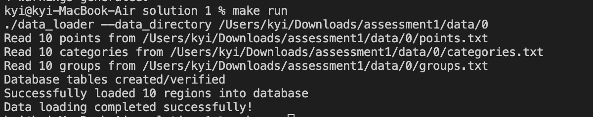
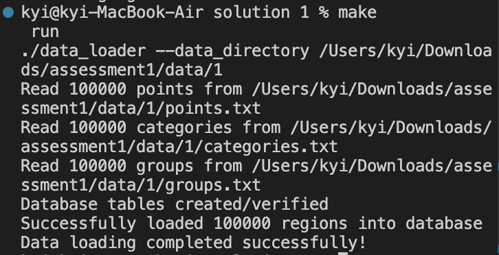

# To run the program:
make

make run

# start running the database:
brew services start postgresql

# Connect to PostgreSQL (uses your current username by default)
psql postgres

# In psql, create the database and user:
CREATE DATABASE inspection_db;

CREATE USER postgres WITH PASSWORD 'password';

ALTER USER postgres WITH SUPERUSER;

# Exit psql
\q

# Output
# use data0

# use data1
